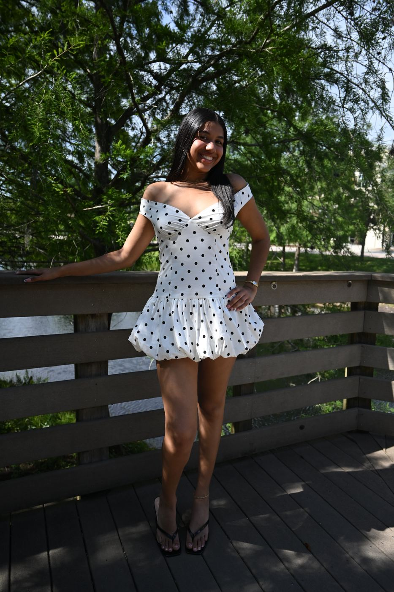

# Adding the two motorcycle photos (and any photos later)

The gallery slots are already wired. You just need to put the files in place
with the right names.

---

## The two bike photos

| Slot | Filename it expects | Which photo |
|------|--------------------|-------------|
| 5 | `images/work-05.jpg` | Him leaning over the white bike, looking down |
| 6 | `images/work-06.jpg` | Him looking at camera, headlight on with green glow |

Names must match **exactly** — lowercase, `.jpg`, with the dash. `Work-05.JPG`
or `work-5.jpg` will not load.

### Step 1 — Shrink them first

Your originals are far bigger than a website needs, and oversized photos are
the main reason portfolio sites feel slow.

Go to <https://squoosh.app> (free, runs in your browser, nothing to install):

1. Drag your photo in.
2. On the right panel, set **Resize** → longest edge **1400** pixels.
3. Set the format dropdown to **MozJPEG**, quality around **78**.
4. Watch the file size readout at the bottom — aim for **under 400 KB**.
5. Click the download arrow.

Repeat for the second photo.

### Step 2 — Rename them

Rename the two downloads to exactly `work-05.jpg` and `work-06.jpg`.

### Step 3 — Put them in the images folder

**If you haven't uploaded to GitHub yet:** drop both files into the `images`
folder alongside the existing photos, then follow `DEPLOY-GITHUB-PAGES.md`
as written.

**If your site is already live:** in your repo, click into the `images` folder →
**Add file → Upload files** → drag both in → **Commit changes**. Live in about
a minute.

### Step 4 — Check it

Open `index.html`. Slots 5 and 6 of the gallery should show your photos. If you
see a broken-image icon instead, the filename doesn't match — check for capital
letters or `.jpeg` instead of `.jpg`.

---

## Adding the last three photos later

Three slots are still empty (they show as dark dashed boxes). To fill one:

1. Open `index.html`, find this block — there are three identical ones:

   ```html
   <div class="photo-card" style="background:#181818;border:1px dashed #2a2a2a;">
     <div class="photo-overlay"></div>
   </div>
   ```

2. Replace one with:

   ```html
   <div class="photo-card">
     
     <div class="photo-overlay"></div>
   </div>
   ```

3. Add `work-07.jpg` to the `images` folder. Next ones are `work-08` and
   `work-09`.

**Write a real description in the `alt` text.** "Bride laughing during golden
hour in Prospect Park" beats "photo" — it's what screen readers announce and
what Google reads to understand your work.

---

## Two things worth knowing

**Your existing four photos have WebP versions, these two won't.** WebP is a
newer format that's roughly 40% smaller. It's a nice-to-have, not a
requirement — a properly sized JPEG is completely fine. If you want me to
generate WebP versions later, I'd need the actual files.

**Slot sizes vary by design.** The grid gives each position a different shape —
slot 5 is a wide 16:9 banner, slot 6 is square. Photos are center-cropped to
fit, so anything critical near the edge of the frame may get trimmed. If a crop
looks wrong, tell me which slot and I'll adjust that position's shape.
